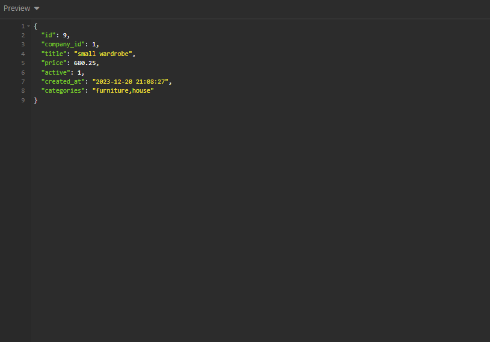
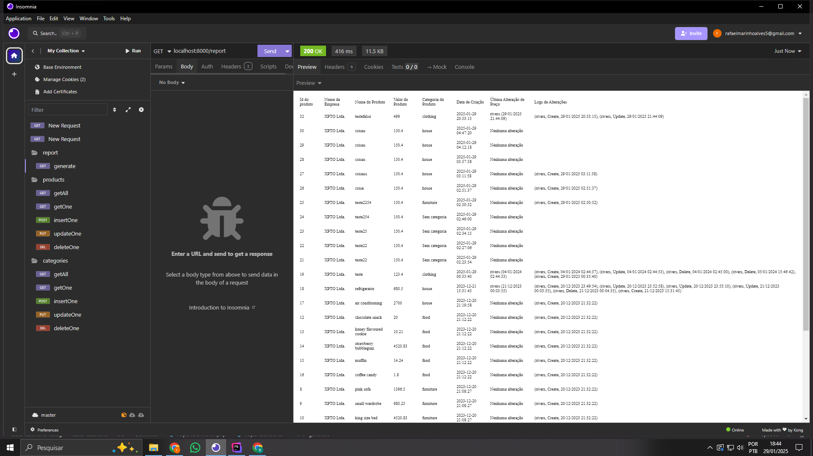
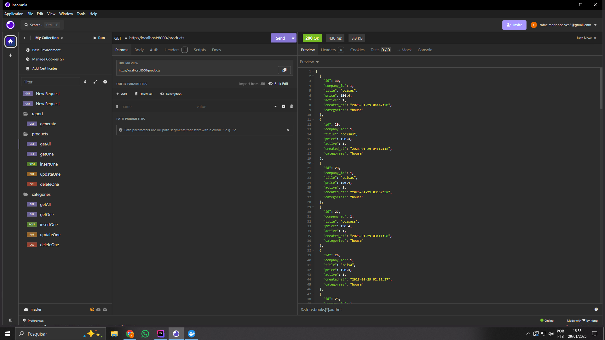
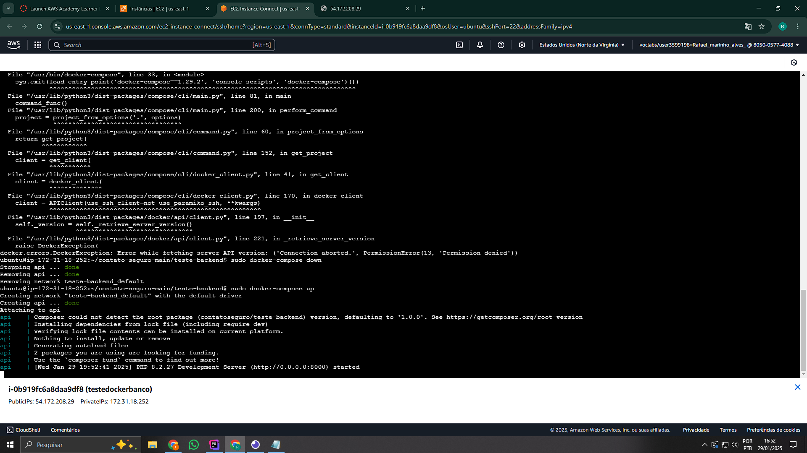

# DESAFIO BACKEND

## Configuração do Ambiente

### Requisitos
- Instalar o _PHP >= 8.0_ e [extensões](https://www.php.net/manual/pt_BR/extensions.php) (**não esquecer de instalar as seguintes extensões: _pdo_, _pdo_sqlite_ e _sqlite3_**);
- Instalar o [_SQLite_](https://www.sqlite.org/index.html);
- Instalar o [_Composer_](https://getcomposer.org/).

### Instalação
- Instalar dependências pelo _composer_ com `composer install` na raiz do projeto;
- Servir a pasta _public_ do projeto através de algum servidor.
  (_Sugestão [PHP Built in Server](https://www.php.net/manual/en/features.commandline.webserver.)_. Exemplo para servir a pasta public: `php -S localhost:8000 -t public`)

## Sobre o Projeto

- O cliente XPTO Ltda. contratou seu serviço para realizar alguns ajustes em seu sistema de cadastro de produtos;
- O sistema permite o cadastro, edição e remoção de _produtos_ e _categorias de produtos_ para uma _empresa_;
- Para que sejam possíveis os cadastros, alterações e remoções é necessário um usuário administrador;
- O sistema possui categorias padrão que pertencem a todas as empresas, bem como categorias personalizadas dedicadas a uma dada empresa. As categorias padrão são: (`clothing`, `phone`, `computer` e `house`) e **devem** aparecer para todas as _empresas_;
- O sistema tem um relatório de dados dedicado ao cliente.

## Sobre a API
As rotas estão divididas em:
  -  _CRUD_ de _categorias_;
  - _CRUD_ de _produtos_;
  - Rota de busca de um _relatório_ que retorna um _html_.

E podem ser acessadas através do uso do Insomnia, Postman ou qualquer ferramenta de sua preferência.

**Atenção**, é bem importante que se adicione o _header_ `admin_user_id` com o id do usuário desejado ao acessar as rotas para simular o uso de um usuário no sistema.

A documentação da API se encontra na pasta `docs/api-docs.pdf`
  - A documentação assume que a url base é `localhost:8000` mas você pode usar qualquer outra url ao configurar o servidor;
  - O _header_ `admin_user_id` na documentação está indicado com valor `1` mas pode ser usado o id de qualquer outro usuário caso deseje (_pesquisando no banco de dados é possível ver os outros id's de usuários_).
  
Caso opte por usar o [Insomnia](https://insomnia.rest/) o arquivo para importação se encontra em `docs/insomnia-api.json`.
Caso opte por usar o [Postman](https://www.postman.com/) o arquivo para importação se encontra em `docs/postman-api.json`.

## Sobre o Banco de Dados
- O banco de dados é um _sqlite_ simples e já vem com dados preenchidos por padrão no projeto;
- O banco tem um arquivo de backup em `db/db-backup.sqlite` com o estado inicial do projeto caso precise ser "resetado".

## Demandas
Abaixo, as solicitações do cliente:

### Categorias
- [x] A categoria está vindo errada na listagem de produtos para alguns casos
  (_exemplo: produto `blue trouser` está vindo na categoria `phone` e deveria ser `clothing`_);
- [x] Alguns produtos estão vindo com a categoria `null` ao serem pesquisados individualmente (_exemplo: produto `iphone 8`_);
- [x] Cadastrei o produto `king size bed` em mais de uma categoria, mas ele aparece **apenas** na categoria `furniture` na busca individual do produto.

### Filtros e Ordenamento
Para a listagem de produtos:
- [x] Gostaria de poder filtrar os produtos ativos e inativos;
- [x] Gostaria de poder filtrar os produtos por categoria;
- [x] Gostaria de poder ordenar os produtos por data de cadastro.

### Relatório
- [x] O relatório não está mostrando a coluna de logs corretamente, se possível, gostaria de trazer no seguinte formato:
  (Nome do usuário, Tipo de alteração e Data),
  (Nome do usuário, Tipo de alteração e Data),
  (Nome do usuário, Tipo de alteração e Data)
  Exemplo:
  (John Doe, Criação, 01/12/2023 12:50:30),
  (Jane Doe, Atualização, 11/12/2023 13:51:40),
  (Joe Doe, Remoção, 21/12/2023 14:52:50)

### Logs
- [x] Gostaria de saber qual usuário mudou o preço do produto `iphone 8` por último.

### Extra
- [x] Aqui fica um desafio extra **opcional**: _criar um ambiente com_ Docker _para a api_.

**Seu trabalho é atender às 7 demandas solicitadas pelo cliente.**

Caso julgue necessário, podem ser adicionadas ou modificadas as rotas da api. Caso altere, por favor, explique o porquê e indique as alterações nesse `README`.

Sinta-se a vontade para refatorar o que achar pertinente, considerando questões como arquitetura, padrões de código, padrões restful, _segurança_ e quaisquer outras boas práticas. Levaremos em conta essas mudanças.

Boa sorte! :)

## Suas Respostas, Duvidas e Observações
[Adicione  aqui suas respostas, dúvidas e observações]

1= so modifiquei a consulta do get all adicionando o pc.cat_id para puxar pelo id da categoria e nao do produto 

2= alguns produtos vinham como null na pesquisa individual entao precisei modificar a consulta do getone e o seu controller, ajustando o filtro que so buscava se tivesse company_id

3= adicionei um GROUP_CONCAT(c.title) AS categories para combinar as categorias de um produto com o mesmo titulo, 

4=Adicionado filtro no SQL para o campo active, controlado pela query (?active=1/0). Permite filtrar apenas produtos ativos ou inativos.

5=Adicionado filtro no SQL para o campo category_id, controlado pela (?category_id=3). Permite filtrar pela categoria selecionada.

6=Adicionada cláusula ORDER BY p.created_at DESC no SQL. Todos os produtos são retornados em ordem decrescente de data de cadastro por padrão.

codigo com os filtros das respostas 4,5 e com o ordenamento da 6

        if (isset($filters['active'])) {
            $query .= " AND p.active = :active";
        }

        if (isset($filters['category_id'])) {
            $query .= " AND c.id = :category_id";
        }

        $query .= " GROUP BY p.id ORDER BY p.created_at DESC";

        $stm = $this->pdo->prepare($query);

        $stm->bindParam(':admin_user_id', $adminUserId, \PDO::PARAM_INT);

        if (isset($filters['active'])) {
            $stm->bindParam(':active', $filters['active'], \PDO::PARAM_INT);
        }

        if (isset($filters['category_id'])) {
            $stm->bindParam(':category_id', $filters['category_id'], \PDO::PARAM_INT);
        }

        $stm->execute();
        return $stm;

endpoints:  http://localhost:8000/products?category_id=5 e http://localhost:8000/products?active=1
justificativa: optei por filtros no mesmo endpoint para seguir o padrao rest

7= Ajustei o método getLog no ProductService para realizar um JOIN com a tabela admin_user, recuperando o nome do administrador associado ao admin_user_id, 
  Formatei os logs no ReportController para exibir (Nome do usuário, Tipo de alteração, Data) usando sprintf e transformei os logs em uma string com implode, Atualizei um pouco a tabela do relatório para incluir a coluna de logs formatados corretamente.

    public function getLog($productId)
    {
        $query = "
    SELECT 
        pl.action,
        pl.timestamp,
        au.name AS admin_user_name
    FROM 
        product_log pl
    INNER JOIN 
        admin_user au ON pl.admin_user_id = au.id
    WHERE 
        pl.product_id = :product_id
    ";

        $stm = $this->pdo->prepare($query);
        $stm->bindParam(':product_id', $productId, \PDO::PARAM_INT);
        $stm->execute();

        return $stm;
    }

8= criei uma funçao getLastPriceChange a qual me retorna o usuario e horario que fez um update no produto e joguei em uma nova coluna do report.

    public function getLastPriceChange($productId)
    {
      $query = "
    SELECT
      pl.admin_user_id,
      au.name AS admin_user_name,
    pl.timestamp
    FROM
      product_log pl
      INNER JOIN
    admin_user au ON pl.admin_user_id = au.id
    WHERE
    pl.product_id = :product_id
       AND pl.action = 'update'
    ORDER BY
        pl.timestamp DESC
    LIMIT 1
    ";
        $stm = $this->pdo->prepare($query);
        $stm->bindParam(':product_id', $productId, \PDO::PARAM_INT);
        $stm->execute();

        return $stm->fetch(\PDO::FETCH_ASSOC);
    }

   

9= criei um dockerfile para criar a imagem do container e definir dependecias, um compose para gerenciar o container na raiz do projeto para rodar na porta 8000, 
e por fim um script .sh para garantir que as dependencias do composer e o server do php rodem quando for executado, a seguir imagens do contanier em funcionamento local e na AWS em uma instancia ec2

